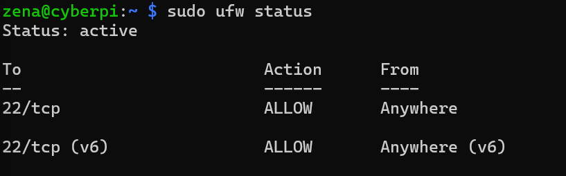
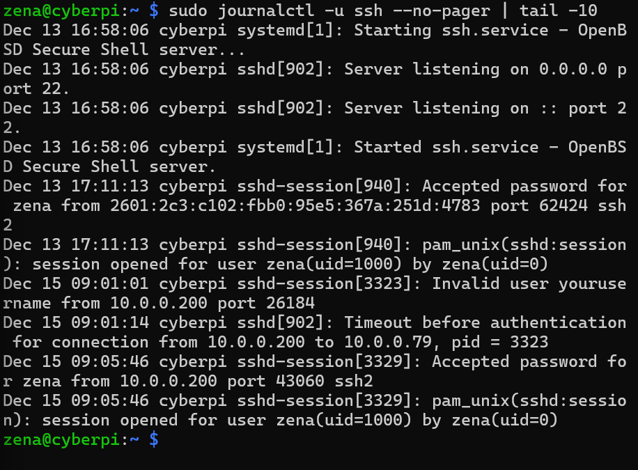

# Home SOC Lab – Raspberry Pi

## Overview
This project is a hands-on Home Security Operations Center (SOC) lab built using a Raspberry Pi.  
The goal was to configure, secure, and monitor a Linux system using real-world defensive security tools.

## Environment
- Hardware: Raspberry Pi (CanaKit)
- OS: Debian GNU/Linux (Raspberry Pi OS)
- Network: Home Wi-Fi
- Access: SSH from Windows ThinkPad

## Security Controls Implemented

### Firewall (UFW)
- Installed and configured Uncomplicated Firewall (UFW)
- Default policy: deny all incoming traffic
- Allowed SSH (port 22) for secure remote management

### Intrusion Prevention (Fail2Ban)
- Installed and enabled Fail2Ban
- Configured SSH jail to monitor authentication attempts
- Automatically blocks IPs after repeated failed login attempts

### Logging & Monitoring
- Reviewed authentication and sudo activity using `journalctl`
- Verified successful SSH logins and privilege escalation events
- Confirmed system integrity and normal behavior baseline

## Skills Demonstrated
- Linux system administration
- SSH configuration and secure remote access
- Firewall rule management
- Log analysis and interpretation
- Intrusion prevention concepts
- Security hardening best practices

## Example Commands Used
```bash
sudo ufw allow ssh
sudo ufw enable
sudo journalctl -u ssh
sudo fail2ban-client status

## Evidence

### Firewall Status


### Fail2Ban Protection


### SSH Authentication Logs



