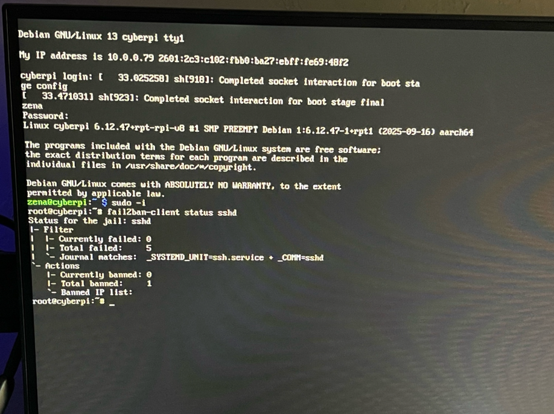
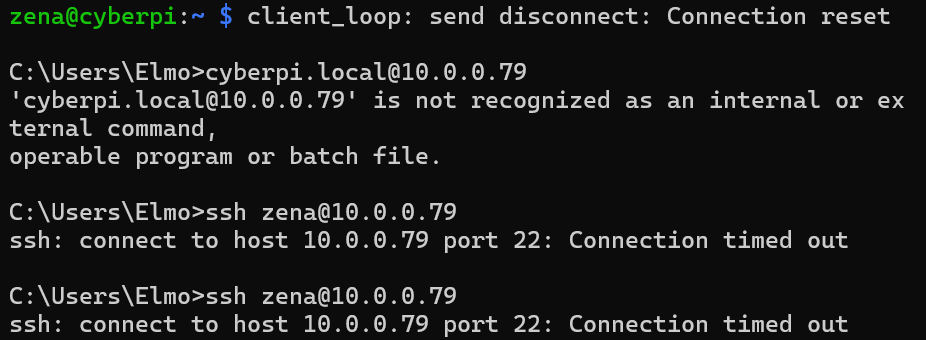
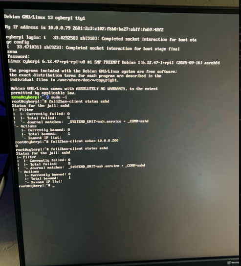
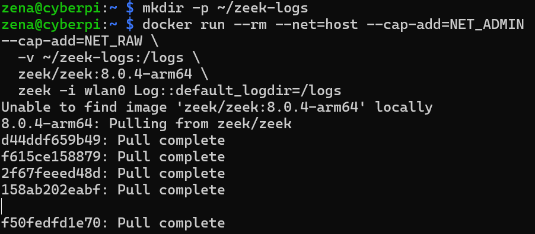
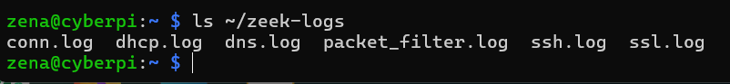
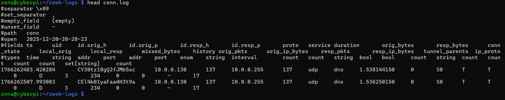
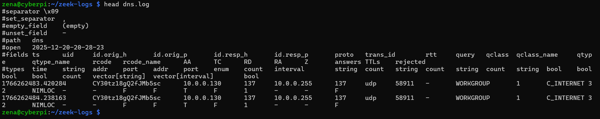

# Home SOC Lab – Raspberry Pi

## Overview
This project is a hands-on Home Security Operations Center (SOC) lab built using a Raspberry Pi.  
The goal was to configure, secure, and monitor a Linux system using real-world defensive security tools.

## Environment
- Hardware: Raspberry Pi (CanaKit)
- OS: Debian GNU/Linux (Raspberry Pi OS)
- Network: Home Wi-Fi
- Access: SSH from Windows ThinkPad

## Security Controls Implemented

### Firewall (UFW)
- Installed and configured Uncomplicated Firewall (UFW)
- Default policy: deny all incoming traffic
- Allowed SSH (port 22) for secure remote management

### Intrusion Prevention (Fail2Ban)
- Installed and enabled Fail2Ban
- Configured SSH jail to monitor authentication attempts
- Automatically blocks IPs after repeated failed login attempts

### Logging & Monitoring
- Reviewed authentication and sudo activity using `journalctl`
- Verified successful SSH logins and privilege escalation events
- Confirmed system integrity and normal behavior baseline

## Skills Demonstrated
- Linux system administration
- SSH configuration and secure remote access
- Firewall rule management
- Log analysis and interpretation
- Intrusion prevention concepts
- Security hardening best practices

## Example Commands Used

```bash
sudo ufw allow ssh
sudo ufw enable
sudo journalctl -u ssh
sudo fail2ban-client status
```
## Architecture Overview

```text
[ Attacker / Client ]
        |
        |  SSH (Port 22)
        v
[ Raspberry Pi (Debian Linux) ]
        |
        |-- UFW Firewall (Access Control)
        |-- OpenSSH (Authentication)
        |-- Fail2Ban (Detection & Enforcement)
        |
        v
[ System Logs / Journalctl ]
```

## Evidence

The following screenshots validate host-based security controls implemented on a Raspberry Pi SOC environment. Controls include firewall enforcement (UFW), intrusion detection and prevention (Fail2Ban), and SSH authentication monitoring.

### Firewall Enforcement (UFW)

UFW is enabled with explicit allow rules. Default deny blocks unsolicited inbound traffic, reducing attack surface.

### Intrusion Prevention (Fail2Ban)


Fail2Ban is active and monitoring SSH. Repeated failed authentication attempts trigger automated IP bans.

### SSH Authentication Monitoring

SSH logs show authentication attempts and enforcement actions, confirming visibility and auditability.

### Brute Force Detection & Automated Response

Simulated brute-force attempts crossed thresholds and resulted in automatic bans—controls function as designed.


## Network Monitoring & IDS (Zeek)

This lab extends the Home SOC by deploying **Zeek IDS** using Docker on a Raspberry Pi (ARM64).
Zeek is used to passively monitor live network traffic and generate structured security logs
for analysis.

### Zeek Deployment
- Platform: Raspberry Pi (ARM64 / aarch64)
- Deployment: Docker container
- Interface monitored: wlan0
- Log output directory: `~/zeek-logs`

### Traffic Captured
To validate monitoring, outbound traffic was intentionally generated:
- ICMP traffic (`ping google.com`)
- HTTP/HTTPS requests (`curl example.com`)

### Logs Generated
Zeek successfully captured and stored:
- `conn.log` – connection metadata (source, destination, protocol, duration)
- `dns.log` – DNS queries and responses

## Evidence

The following screenshots validate Zeek deployment and network traffic logging:

### Zeek Container Running


### Zeek Logs Directory


### Connection Log (conn.log)


### DNS Log (dns.log)


## Host-Based Intrusion Detection (Wazuh Agent)

The Wazuh agent was installed on the Raspberry Pi to extend host-based security monitoring as part of the Home SOC architecture.

### Installation Status
- Platform: Raspberry Pi (ARM64 / Debian 13)
- Wazuh Agent Version: 4.14.1
- Service: Installed and enabled
- Agent Status: Not started (manager not deployed)

### Configuration Notes
The Wazuh agent requires a Wazuh Manager to establish a secure connection. At this stage of the lab, no manager has been deployed, so the agent service is intentionally not running.

The default configuration file includes a placeholder value:


This value will be replaced when a Wazuh Manager is deployed in a future lab.

### Verification
- Wazuh agent package installed successfully
- Configuration file present at `/var/ossec/etc/ossec.conf`
- Service enabled but inactive due to missing manager

